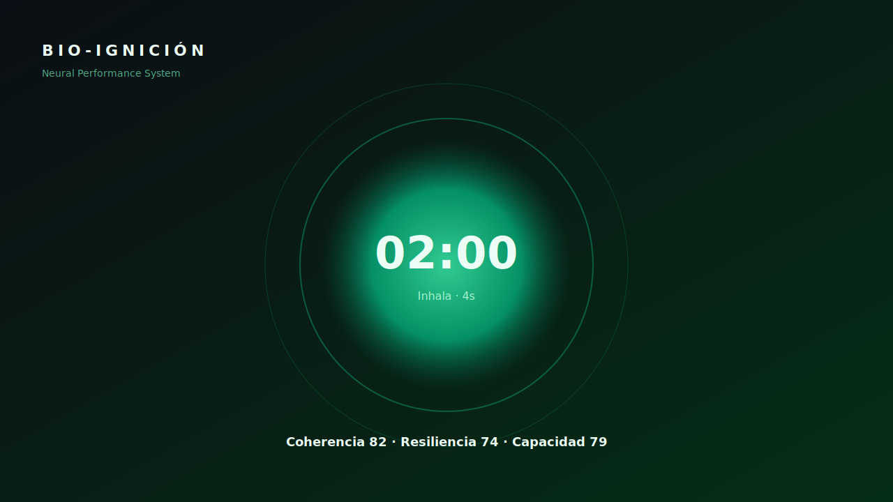

# BIO-IGNICIÓN · Neural Performance PWA

Plataforma de optimización humana basada en sesiones de 60–180 s con protocolos neurales, feedback sensorial (audio, haptics, binaural, voz) y telemetría local cifrada.



## ⚡ Stack

- **Next.js 16** (App Router, React Compiler, standalone output)
- **React 19**, **Zustand 5**, **Framer Motion 12**, **Recharts 3**, **Tailwind 4**
- **Vitest 4** con jsdom + Testing Library + cobertura v8
- **PWA**: Service Worker v6, manifest rich, Push, Background Sync, Periodic Sync

## 🚀 Desarrollo

```bash
npm install
npm run dev          # http://localhost:3000
npm run test         # vitest
npm run test:coverage
npm run build        # output: standalone
```

## 🗺️ Estructura

```
src/
├── app/              # Next App Router (layout, page, /privacy)
├── components/       # UI modular
├── hooks/            # Hooks desacoplados (timer, deeplink, sync, wakelock, t)
├── lib/              # neural, protocols, audio, storage, sync, push, i18n, deeplink, logger
├── store/            # Zustand store con persistencia async
└── middleware.js     # CSP con nonce + rate-limit
public/
├── sw.js             # Service Worker v6
├── offline.html      # Fallback offline
├── manifest.json     # Manifest rich (shortcuts, share_target, protocol_handlers)
├── icon*.svg         # Iconos (any, maskable, monochrome)
└── screenshots/      # Screenshots para PWA install UI
```

## 🔐 Privacidad y seguridad

- **Local-first**: estado cifrado **AES-GCM 256** en IndexedDB con fallback `localStorage`.
- **CSP con nonce** por request emitido desde `middleware.js`.
- **Sin PII** en logs; sampling configurable vía `NEXT_PUBLIC_LOG_SAMPLE`.
- **Consent banner** y página `/privacy` conforme a GDPR/LFPDPPP.
- **Deep links NFC/QR** validados y opcionalmente firmados con HMAC-SHA256.

## 🌐 PWA · Características

| Capacidad | Estado |
|---|:---:|
| Instalable (iOS/Android/Desktop) | ✅ |
| Offline fallback | ✅ (`/offline.html`) |
| Shortcuts (3) | ✅ |
| Screenshots wide + narrow | ✅ |
| Share Target | ✅ |
| Protocol Handlers (`web+bioign://…`) | ✅ |
| Edge Side Panel | ✅ |
| Web Push + VAPID | ✅ (requiere `NEXT_PUBLIC_VAPID_PUBLIC_KEY`) |
| Background Sync | ✅ |
| Periodic Sync | ✅ |
| Navigation Preload | ✅ |

## 🔧 Variables de entorno

```env
NEXT_PUBLIC_BASE_URL=https://bio-ignicion.app
NEXT_PUBLIC_SYNC_ENDPOINT=https://api.example.com
NEXT_PUBLIC_VAPID_PUBLIC_KEY=...
NEXT_PUBLIC_DEEPLINK_SECRET=...
NEXT_PUBLIC_LOG_ENDPOINT=https://log.example.com/ingest
NEXT_PUBLIC_LOG_SAMPLE=0.1
NEXT_PUBLIC_LOG_LEVEL=warn
```

## 🧪 Tests

Cobertura mínima exigida: **70% líneas / funciones / statements**, 60% ramas.

```bash
npm run test:coverage
```

## 📚 Documentación adicional

- [ARCHITECTURE.md](ARCHITECTURE.md) — decisiones de arquitectura
- [CLAUDE.md](CLAUDE.md) — guía para trabajo asistido por Claude

## 📝 Licencia

Propietaria. © BIO-IGNICIÓN
